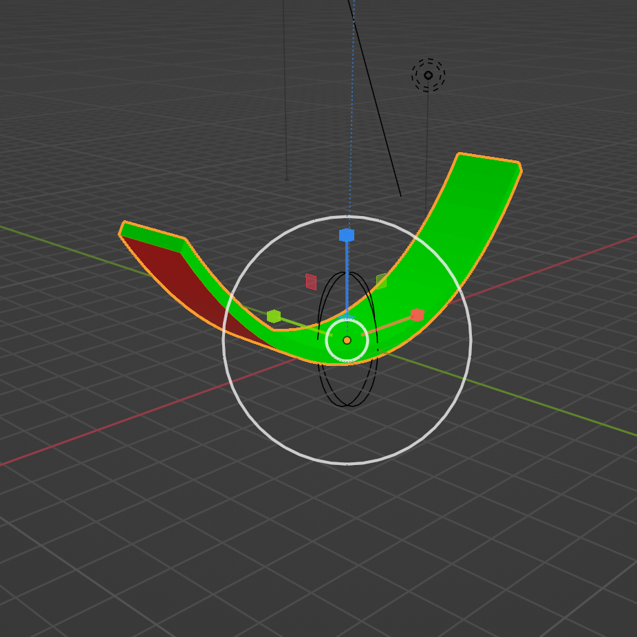

# Equivariance to Temporal Dynamics in Neural Scene Representations

## Introduction

Designing effective 3D scene representations for neural networks poses significant challenges. While traditional representations like voxel grids, meshes, point clouds, and signed distance functions have been used before, each comes with its own limitations. These difficulties include incorporating texture, lighting, and background. Recent advancements in neural scene representations have aimed to overcome these challenges by integrating ideas from graphics rendering into the model architecture. In this blog post, we build upon the work presented by Dupont et al. (2020) and extend it by incorporating **equivariance to temporal dynamics**, later refered to as **temporal equivariance**, to enhance the realism and versatility of the rendered scenes.

Our work extends upon this foundation of **rotation equivariance** by introducing the concept of temporal equivariance into the neural scene representation framework. We believe that incorporating temporal equivariance provides an additional layer of realism and further expands the capabilities of our model. By training our model using only images and their relative poses, we eliminate the need for pose information at inference time. This empowers our model to infer and render scene representations in real-time, whereas previous scene representation algorithms required significant time for inference.

While existing works have primarily focused on training models on images of an object that is not able to deform over time, our objective is to generalize across different time stamps. With this method the aim is to create a model that takes into account at what time step a certain input is and how it changes over time. Our approach eliminates the need for object to be unchanged relative to any deformation

### Key points
This section covers the key points mentioned in the authors paper.

#### Scene Representations
In the paper a distinction is made between **implicit** and **explicit** scene representation. Explicit representations, such as 3D meshes, are interpretable by humans and rendered using fixed processes like raytracing. Implicit representations, on the other hand, are abstract and need not be human interpretable. It is mentioned in the paper that as long as the representation is explicit and this characteristic is not altered when performing a transformation, the **underlying characteristics** of the representation can be captured.

#### Equivariance
In the study we are reproducing, the researchers center their investigation around the concept of equivariance within the field of neural rendering. The research analyses equivariance. This refers to a model's ability to reflect the same transformation on the output as is applied to the input. In mathematical terms, if we have a transformation T, an equivariant model would satisfy **T(Model(input)) = Model(T(input))**.

A concept that is part of equivariance is **transformation equivariance**. Transformation equivariance can be seen as a generalization of the concepts of rotation and temporal equivariance. It refers to the model's ability to return an output that is subject to the same transformation as the input. This includes **rotations**, **scaling**, **translations**, or even more complex operations. In the context of neural rendering, this means that a model would be able to correctly interpret and render scenes regardless of how they are presented or transformed.

The significance of this concept becomes evident when considering **real-world scenes**, which are dynamic and subject to constant changes in **movement**, **rotation** and **scale**. Models limited to specific transformations might fail to accurately render scenes involving other types of transformations, making the exploration of transformation equivariance crucial for real life application.

Within this framework, the authors' emphasis on rotation equivariance is central. They suggest that by training models on **3D representations** derived from image pairs taken from different angles, a deeper understanding of complex spatial relationships within and between objects can be achieved. This understanding extends beyond the distinction of structure, background, and lighting, to predicting transformations, such as shadow movement during object rotation or changes in an object's apparent shape based on the viewpoint. This understanding of spatial transformations allows **rotation-equivariant models** to render new scenes from various angles with a high degree of accuracy.

We extend on this realizing that the ultimate goal is to generalize this to transformation equivariance, enabling models to handle any transformations, not merely rotations, to produce accurate renderings. Eventhough there exists **limitations** in the understanding of some object dynamics, or in this case temporal dynamics. Without specificing the transformation through some group action, our model is able to learn the deformation over time.
### Methodology

#### Relative Transformations
The paper utilizes a training methodology that does not depend on 3D supervision. No 3D representation is needed as this is extracted as a neural representation from the object images, this serves as an implicit 3D representation. To understand what this means, it's helpful to contrast explicit and implicit 3D representations.

Explicit 3D representations, such as meshes, provide a direct and clear geometrical description of the 3D scene or object. They are of highly structured nature consisting of vertices, edges, and faces. These components together form the explicit representation. Although they offer precision, these representations can become highly complex, potentially limiting their capacity to effectively generalize across varying contexts.

On the other hand, implicit representations represent 3D information indirectly. Rather than directly defining the geometry, they use a function to indicate whether a point is inside or outside the object (occupancy) or to give some other property (such as color or density) at a given point. While these do not provide the same level of geometric precision, they can be more flexible and easier to learn from data.

The dataset consists of pairs of views of an object scene, in addition to this it contains the relative camera transformation. This transformation is considered as a transformation of a camera on a sphere, with the camera pointed at the origin. This approach allows for learning scene representations that generalize well across various camera transformations.

#### Model Architecture and Training objective

The model consists out of two main modules: The inverse renderer which converts a 2D image into a 4-dimensional scene representation, and a forward renderer which renders a 2D image from a scene representation. The inverse renderer constructs image features through a ResNet-based CNN (blue). These features are then upscaled to 3D (purple) and fed through a ResNet-based 3D-CNN (green). The output of the 3D-CNN eventually builds the scene representation. The forward renderer is the transpose of the inverse renderer.

The scene representations is a 4-dimensional latent space and orgnized as (Channels, depth, height, width). This latent space can get rotated by applying a spherical mask and then multiplying by an arbitrary rotation matrix. That way, it is possible to render images from different perspectives given a single input image.

Because rotational equivariance is not given by default, the authors introduce a loss function that forces the model to be equivariant towards rotation. Each object in the training set contains multiple images taken from different angles. Images in a batch are sampled in pairs where each pair contains two images randomly sampled from the same object. Then, the scene representation of the first image is rotated to the angle of the second image and vice versa. Then, the scene representations are swapped and rendered. The final loss is the l1 or l2 distance between input and output image. The authors add SSIM loss to weight structure higher.

We add temporal equivariance in the following way. In the inverse renderer, we add another dimension after the 3d-CNN and add another CNN which consists out of a transposed convolution and two ResNet blocks. The new scene representation has the shape (temporal, channels, depth, height, width) and our goal is to make the network learn a separate scene representation for every step we can go for- or backward in time. Before rotating and rendering, we select a scene representation for an arbitrary but specific time step. Thus, we didn't change the architecture of the forward renderer.

We leave the training logic as is. Because every object of our novel dataset contains images at different angles and different temporal steps, we automatically sample pairs of images with both different angles and at different temporal steps. In addition to rotation the first image to the second's angle and vice versa, we select the scene representation at the temporal index which matches the difference to the other image. Thus, we can leave the loss function, the data sampling, and rotation as is.

To manage the computational complexity of this new model, we significantly reduce the number of channels in the scene representation from 64 to 3. We validated that this doesn't decrease accuracy for our simple dataset.

  

#### Temporal dimension
With this extension an attempt is made to apply an estimation of the **group action** for the temporal dynamics present on our **latent space(temporal dimension)**. A new later of complexity is added to the model by doing this. Traditional transformations such as rotation or translation are inherently geometric and hence can be easily represented mathematically, allowing us to express such operators explicitly within the latent space. Baking these group operations in the model structure is feasible as these transformations are not object specific. The challenge lies in our inability to define a corresponding operator responsible for time in the latent space precisely. Temporal deformations, unlike geometric ones, involve changes that are not straightforward to describe mathematically, often due to their oddly specific mechanisms and dependence on a large amount of factors. 

However, inspired by the lifting correlation implemented in group equivariant deep learning, our model’s approach can be described as inventive. Rather than attempting to to **explicitly** capture these transformations, the model learns to **implicitly** capture the possible deformation over time via the encoder. As mentioned earlier, inspired by lifting correlation, a third dimension in the scene representation is created to account for different time steps. The model learns the change over time for the temporal dimension in the latent space. The capacity of our model to cope with transformations that are not readily described aligns with the more complicated, real-world scenarios where transformations might not fall under classical geometric transformations.

### Related work
In the paper ["Geometry processing with Neural Fields"](https://papers.nips.cc/paper/2021/file/bd686fd640be98efaae0091fa301e613-Paper.pdf) research was done to see whether objects could be deformed using neural fields. This paper inspired the idea of deforming an object including a temporal aspect. In this paper they show that some of the most challenging geometry processing tasks, such as deformation and filtering, can be done with neural fields. Which would indicate that deforming the object over time would be feasible for our paper. 

## Strengths
The following section covers the strengths of the paper.

- **No 3D Supervision Required**: The model's ability to train without explicit 3D supervision is one of the benificial characteristics. By utilizing a neural radiance field and continuous representations of objects, the model can learn equivariant representations solely from images of the object and their relative poses. 

- **Flexibility in Rendering Process**: The formulation of the model does not impose any restrictions on the rendering process. This enables the model to capture and model complex visual effects, including reflections and cluttered backgrounds. Unlike some other scene representation models that have predefined rendering processes, the flexibility of neural radience fields allows for more realistic and versatile rendering capabilities. This increases the overall quality of the scenes modelling and the efficiency.

- **Pose-Free Inference**: Unlike many existing scene representation models, the proposed model does not require pose information at inference time. From a single image, the model can infer a scene representation, transform it, and render it accurately. This eliminates the need for additional pose information added during inference. This makes the model more applicable in real-life use cases. 

- **Real-Time Inference**: The model demonstrates the capability to perform inference and rendering in real time, which is a notable strength. While traditional scene representation algorithms often require significant computational resources and minutes of processing time to infer scenes from images, the proposed model overcomes these limitations. The ability to generate scene representations and render novel views in real time opens up possibilities for interactive applications that demand immediate scene understanding and visualization.

The mentioned strengths highlight the model's efficiency, flexibility, and ability to learn meaningful scene representations from image data alone. These attributes contribute to its potential for various real-world applications and make it an appealing choice for researchers and practitioners in the field of scene representation and rendering.

## Weaknesses
Having a model that is solely rotation invariant poses a significant weakness when it comes to processing images. It fails to account for other some crucial factors such as deformation, translation and scaling. Images can exhibit various transformations beyond rotation, including **stretching**, **squeezing**, and **bending**. Such transformations can drastically alter their appearance. If a model is unable to handle these deformations, it may struggle to accurately recognize or classify objects in real-world scenarios. Which in return makes it complicated to perform other tasks focussing on these objects. 

Additionally, the deformation of objects within an image, is a common occurrence in different contexts. A model lacking deformation invariance may struggle to identify objects that have undergone some object specific change in structure(e.g. birds flapping wings) and so the model fails to understand their spatial relationships accurately. Therefore, to build a robust and comprehensive image processing model, it is crucial to address not only rotation but also deformation invariance.

## Data

The dataset utilized for this research mirrors the structural design of the original dataset employed by the authors. It encompasses views of a 3D object, rendered uniformly around the object in a spherical pattern. These views are saved as .png images, with both the azimuth and elevation angles documented in a .JSON file. To incorporate a temporal dimension in the training process, the following modifications were made to the dataset:

-   Our data includes newly generated Blender objects, as opposed to using ShapeNet objects. Given the absence of any publicly accessible dataset featuring simple objects evolving over time, we developed our own. The temporal shift involves a bend in the object's Y-axis, the degree of which can be determined.
-   Our JSON file now also records the temporal timestep for each image.
-   The current iteration of our dataset includes 200 images per object, per timestep, compared to the 50 images per object in total. With the use of 20 timesteps, this amounts to 4000 images per object. Both the number of images and timesteps can be adjusted.
-   Our current iteration of the dataset contains an object with a red underside for easier identification of which side of the object is top or bottom.
- The dataset only contains a single object. For the validation and test set, we use images at certain temporal timestamps not included in the training data

The figures below exhibit the original object in Blender, the overview of the renders of training set (with a text overlay), validation set, and test set. The validation set contains timesteps 5 and 10, the test set 9 and 16, and the training set all remaining timesteps.

Blender Object | Training set | Validation set | Test set
:-------------------------:|:-------------------------:|:-------------------------:|:-------------------------:
  |   |   |   

### Object Rendering
To render the blender objects fast and efficiently a python script was created that could rotate the camera around an object in a sphere while keeping the camera pointed at the centre. The way the images were made was replicated to make it as easy as possible to integrate it with their model and only make modifications for the temporal part. In the script we can input the azimuth angle and the elevation angle and the script would calculate at what x, y and z coordinates the camera had to be given a certain radius, 25 in our case. The authors used the figure underneath to describe the image generation process. The azimuth angle was randomly sampled between 0 and 360 degrees and the azimuth angle between -90 and 90 degrees. During the rotations of the camera keyframes were made so that it would be able to be rendered by blender. Each image received a number as filename and was saved as a 128 by 128 pixel file. The same image size as the images the authors use. The elevation and azimuth angle were added into a json file for each image as well as at which temporal timestep the image was rendered. The same format json file format was used as in the original paper. A SimpleDeform modifier was used to bend the object which is a kind of modifier in Blender. We also added a light source so shadows were cast on the object and the object would be more realistic. The object blender file can be found in our GitHub. The python script that was used in blender can also be found in the GitHub repository. The object was deformed according to a sine wave in with a certain amplitude so that the movement would be a repeating one. The data is rendered into a train, validation and test folder with each containing their own json file containing parameters.

    

## Results
### Testing the original model with our dataset
Before we incorporated the temporal aspect into the model we first tested whether the original model could learn our new dataset. Therefore we grouped images with of the same timestep as separate objects. In the image underneath we render multiple of these different "objects" in different angles. Looking at the multiple angles the model can generate we can see that the model has a good understanding of the scene representation of our object.

    

 

### Rendering with the temporal aspect
To infer the scene representation from a single image the image is rendered into a 5D scene representation, with a 4D scene (3D spatial + channels) for every temporal dimension. With this scene representation we can generate novel views for different timesteps. We can select a target timestep and then render views from the 4D representation at the target timestep. In the latent scene representation there are 20 timesteps present. Our model is trained using temporal differences and therefore timestep zero means that the object moves 10 timesteps back in time and timestep 19 moves 10 timesteps forward in time. Timestep 10 would reconstruct the input image as it was. In the images underneath you can see the input image on the left and the rendered image, which has been rendered 7 timesteps back in time, on the right.

    <table>
        <tr>
            <th style = "vertical-align: bottom;">Input image</th>
            <th>Rendered image at timestep 3</th>
        </tr>
        <tr>
            <td align="center">
                
            </td>
            <td align="center">
                
            </td>
        </tr>
    </table>

### Extrapolation: Rendering timesteps never seen in the training data

What if we render all representations for a given image? We would expect that for t \< 10, we see images that are gradually straighter, and for t \> 10, we should see images that are gradually more bent. We also expect that neighboring images look similar, and that no object is rotated. In the figure below, we see that images are rendered correctly, and that images of neighboring timesteps look similar. Note that the representation at t=0 was not trained because a difference of -10 was not present in the dataset. The input image of the example below was taken at the greatest bend. This means that As you can see in the image underneath at timestep 0 the object is not rendered correctly. This occurs because a temporal difference was not present for timestep 0. Therefor the model cannot learn it. The other timesteps show a good understanding of how the model would change over time going backwards or forwards in time.

    

### Interpolation between temporal timesteps
Can we interpolate two scene representations to create even more timesteps and a smoother transition? We tried this by linearly interpolating two scene representations. The model has no explicit objective to make neighboring scene representations similar, smooth, and interpolatable. However, as shown in the figure below, we observed that linear interpolation seems to work fine on our particular dataset, possibly because the nature of the data and training objective forces different scene representations to be similar.

We also experimented with adding an L2-regularizer between neighboring scene representations to force the model to make them similar (code for this is on a different branch in the git repo). This worked great as well, albeit increasing training time slightly. Because our model performs well without the penalty already, we don't see a big difference but think this should be explored with more complex datasets, where smoothness between scene representations might not automatically happen.

    

### Visualizing the 3D scene representation

How does the scene representation encode the object, it's rotation, and it's bend across temporal dimensions? Because we reduced the number of channels in the scene representation from 64 to only 3, we can actually plot this latent space, encoding channels as color, and plotting a 2D slice for every depth. The latent space is learnt implicitly, so we don't expect to necessarily seeing something interpretable.

About the figure: The complete scene representation has the shape of (temporal, channel, depth, width, height). In the animation below, we encode the temporal dimension as time, channel as color, width and height as width and height in every 2D image, and slice the cube along its depth axis to produce 32 images per temporal step.

We observe that the model seems to resemble the object in 3D! That's interesting because we didn't instruct the model to do so. Even more interestingly, we see that the object looks the same at every timestep! It always has the maximal bend. This is advantageous because it's easier to identify how the bent object is rotated than the straight one. Also, the rotation and forward rendering is quite simple if the scene representation is already similar to the object itself.

But how does the model then know the temporal step, aka how much to bend the object, if the object is always bent similarly in the scene representation? As shown in the figure below, the model does this by altering the color of the object and the background.

    

### Rotation on another timestep
We can still rotate the model even for a scene representation in the past or future. In the image underneath the new scene representation for timestep 3 was rotated

    

### Combining timesteps with rotation 
Combining all this we can render multiple rotations for multiple timesteps into the following animation.

   

## Conclusion 

We developed a novel dataset that contains different views of an object that gradually bends. Then, we adapted the work from Dupont et al. (2020) to be not only equivariant to rotation, but also to a temporal dimension in which the object transforms. We achieve this by adding a dimension to the scene representation which essentially forces the model to create a different scene representation for every timestep that the object can be rendered forward and backward in time. The beauty of this approach is that the proposed data sampling and training strategy does not need to be altered, and that the scene representation can be processed further, e.g. by rotating or translating.

We show that we can interpolate the scene representation, and that this property can be used to reduce the number of temporal dimensions needed which reduces training and inference time as well as memory requirements. A training step takes a similar amount of time compared to Dupont et al's model because for every image, only one scene representation gets backpropagated.

We further show that the model can extrapolate to render images at timestamps never seen in the training data. However, when rendering images at timestamps never seen and far away, the rendered image might be a bit blurry of faint.

Lastly, we show that we can interpret the implicitly learned scene representation, and that the temporal dimension seems to be encoded via the color of the background and object in the representation.
